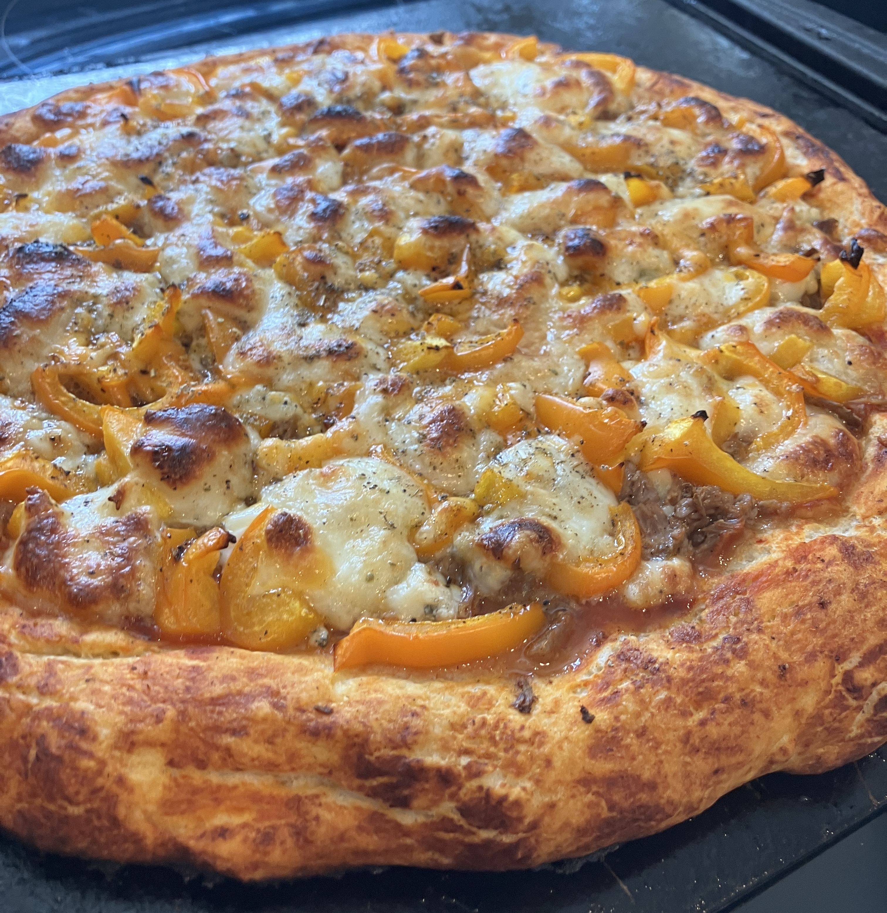

<!DOCTYPE html>
<html lang="en">
<head>
    <meta charset="UTF-8">
    <meta name="viewport" content="width=device-width, initial-scale=1.0">
    <title>Photo Gallery</title>
    
</head>
<body>
    <nav>
      <a href="index.html">About</a>
      <!-- Future tabs:
      <a href="projects.html">Projects</a>
      <a href="contact.html">Contact</a>
      -->
    </nav>
    <h1>About</h1>
    

        <figure>
            
            <figcaption>This is the car my dad was driving a long time ago</figcaption>
        </figure>
        <figure>
            
            <figcaption>This is me during winter</figcaption>
        </figure>
    

</body>
</html>

**Welcome to *Cooking in the Neon Shadows*!**

In the heart of our concrete jungle, where towering skyscrapers meet neon lights, and the hustle of life never ceases, there's a sanctuary for culinary rebels. Dive into a blog that blends gritty realism with vibrant flavors, much like the streets of *Max Payne 3* and the sprawling night city of *Cyberpunk 2077*. Here, we cook in the shadows, but our plates shine brightly!

**From Bullet Time to Dinner Time:**

Just as Max Payne navigates the chaos of his world with precision and skill, you too can master the art of cooking. Every recipe here is a mission—a challenge waiting to be conquered. With each bite, you'll taste the victory of a well-executed plan.

**Cyber-Flavors Await:**

Step into a realm where traditional ingredients meet futuristic techniques. Imagine a world where your taste buds are treated to the unexpected—a symphony of tastes and textures that would make even V from *Cyberpunk* nod in approval. Whether it's a classic dish with a twist or a new culinary invention, you'll find it here.

**Moral Choices, Flavorful Consequences:**

Just as Captain Walker in *The Line* faces tough decisions, so will you in your culinary journey. Do you follow the recipe to the letter, or do you stray from the path and create something entirely your own? The choice is yours, and the outcomes are deliciously unpredictable.

**Stay. Explore. Conquer.**

This isn't just a blog—it's an adventure. Join me as we uncover new ingredients, experiment with bold flavors, and transform everyday meals into extraordinary experiences. Your journey begins now. Welcome to *Cooking in the Neon Shadows*—where every meal is a story waiting to be told.

---

Stay tuned, stay hungry, and remember: The neon lights may fade, but the flavors linger forever. Ready to embark on this culinary quest? Let's cook!
